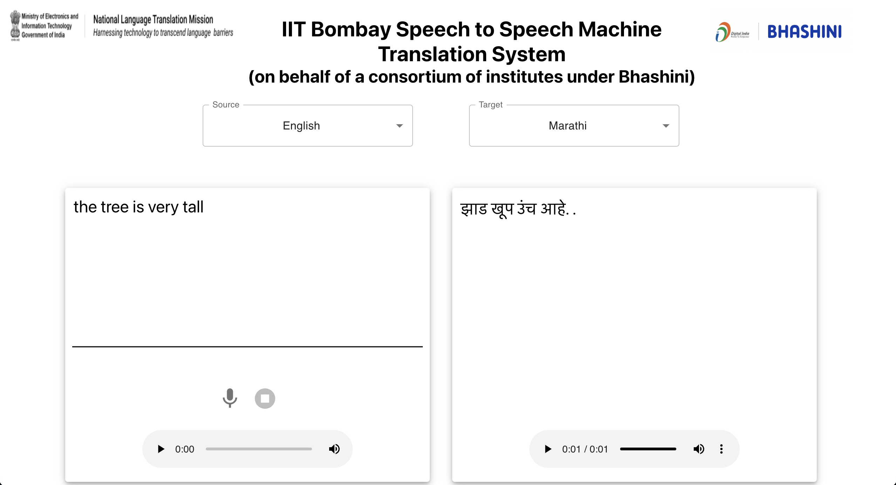

# Speech to Speech Machine Translation System

- This repository contains the backend and frontend code for the Speech to Speech Machine Translation System.
- `speech2speech-backend` folder contains the code for backend which is written in FastAPI
- `speech2speech-frontend` folder contains the code for frontend which is written in ReactJS

# Current Deployment

# Working

1. The SSMT pipeline consists of 3 models, Automatic Speech Recognition (ASR), Machine Translation (MT) and Text-to-Speech (TTS) models.
2. The input speech is passed to the ASR model which transribes the speech and generated the text in source language.
3. The source language text is passed through the MT model which translated the source langauge text to target language text.
4. The target language text is passed to the TTS model which generates the speech in target language.

# Deployment

1. The code is written in such a way that the multiple SSMT pipelines on a single GPU and also across multiple GPUs.
2. The free memory on a GPU is first checked and if sufficient memory is available on a GPU then the models are loaded on that GPU.
3. If sufficient free space is not available on a GPU then the next GPU on the machine is checked.
4. Example: Consider a DGX A100 machine which consists of 8 Nvidia A100 GPUs and the SSMT pipeline occupies a space of 6GB. Then on a single GPU 13 SSMT pipelines can be run. So, across 8 GPUs a total of 13*8=104 SSMT pipelines can be run.
5. The code is written is such a way that it can dynamically load models on multi GPUs machines to utilize the entire GPU memory.
